# AI Multi-Agent Workflow System

Transform your AI workflow into a smart, multi-team system supporting Engineering, Product Management, Business Intelligence, DevOps, Design, and QA departments through specialized agents and dynamic customization.

## ✨ Key Features

- **🤖 Phase-Based Agent System**: Specialized agents for each department (Dev, PM, BI, DevOps, Design, QA) across 4 workflow phases
- **🔄 5-Phase Execution Model**: INIT → ANALYZE → BLUEPRINT → CONSTRUCT → VALIDATE
- **🤝 Cross-Department Collaboration**: Seamless agent handoffs and collaborative planning
- **🚀 Auto-Initialization**: Smart onboarding with project analysis and user profiling
- **🔗 Full Integration**: Jira ticket management, Confluence documentation, Slack notifications
- **📊 ROI Measurement**: Comprehensive tracking of productivity, time savings, and business impact
- **🛠️ Dynamic Workflow Building**: Add custom steps with `/add-step` command during any phase
- **📈 Real-time Progress Tracking**: Live Jira sub-task updates and session monitoring

## 🚀 Installation

### Quick Setup via Git Submodule

Add AI workflow to any project:

```bash
# 1. Add the AI workflow system as a git submodule
git submodule add https://github.com/company/ai-workflow-system.git workflow-system
git submodule update --init

# 2. Run the setup script (creates symlinks for Claude Code and Cursor)
./workflow-system/setup.sh

# 3. Restart Claude Code or Cursor to pick up the new configuration

# 4. Start using the workflow - just ask Claude for help!
```

### What the Setup Script Does

The setup script creates symlinks so Claude Code and Cursor can find the configuration files:

- `CLAUDE.md` → `workflow-system/CLAUDE.md`
- `.cursor/rules/workflow.mdc` → `workflow-system/.cursor/rules/workflow.mdc`

This keeps all workflow logic centralized in the submodule while making it accessible to your AI tools.

### Auto-Initialization

On first use, the LLM will automatically:
1. **User Onboarding**: Ask about your department, role, and preferences
2. **Project Analysis**: Scan your codebase and detect technology stack
3. **Configuration Setup**: Create personalized workflow configuration
4. **Ready to Use**: Execute 4-phase workflows immediately

### File Structure

The system creates a single `.play-perfect-ai-workflow/` folder containing:

```
your-project/
└── .play-perfect-ai-workflow/                    # Complete workflow system
    ├── workflow.mdc            # Workflow execution rules
    ├── CLAUDE.md              # LLM instructions
    ├── user_config.json       # User settings and preferences
    ├── project_config.md      # Project analysis and configuration
    ├── agents/                # Department-specific agent configs
    │   ├── dev-agents.json
    │   ├── pm-agents.json
    │   └── ...
    ├── templates/             # Workflow templates
    └── sessions/              # Session tracking and measurements
        └── measurements.md
```

## 🔄 Detailed Workflow Description

### 5-Phase Execution Model

#### 🔧 Phase 1: INIT
- **Auto-initialization check**: Verifies user configuration and project setup
- **User onboarding**: Department selection, role definition, preference setting
- **Project analysis**: Codebase scanning, technology detection, context gathering
- **Session creation**: Initialize new workflow session with unique ID

#### 🔍 Phase 2: ANALYZE  
**Department-Specific Analyzer Agents:**
- **💻 Dev-Analyzer**: Technical docs, architecture analysis, dependency mapping
- **📊 PM-Analyzer**: Business requirements, stakeholder research, user needs
- **📈 BI-Analyzer**: Data source identification, metrics definition, business context
- **🔧 DevOps-Analyzer**: Infrastructure assessment, deployment pipeline analysis
- **🎨 Design-Analyzer**: User research, design system analysis, accessibility requirements
- **⚙️ QA-Analyzer**: Test requirement analysis, risk assessment, coverage planning

**Actions:**
- Auto-query Jira tickets for context
- Search Confluence documentation
- Gather department-specific requirements
- Map dependencies and constraints

#### 📝 Phase 3: BLUEPRINT
**Department-Specific Blueprinter Agents:**
- **⚙️ Dev-Blueprinter**: Technical architecture, system design, testing strategy
- **📋 PM-Blueprinter**: PRD creation, roadmap planning, feature specification
- **📊 BI-Blueprinter**: Analysis methodology, visualization planning, reporting strategy
- **🔧 DevOps-Blueprinter**: Infrastructure planning, CI/CD design, scaling strategy
- **🎨 Design-Blueprinter**: Design system planning, UX mapping, prototype strategy
- **⚙️ QA-Blueprinter**: Test strategy design, automation planning, quality metrics

**Actions:**
- Create detailed implementation plan
- Present plan for user approval
- **Revision Loop**: Handle user feedback and plan modifications
- Generate Jira sub-tasks automatically (after final approval)
- Enable cross-department collaboration

#### 🔨 Phase 4: CONSTRUCT
**Department-Specific Constructor Agents:**
- **💻 Dev-Constructor**: Code implementation, testing execution, deployment
- **📝 PM-Constructor**: Documentation creation, stakeholder coordination
- **📊 BI-Constructor**: Data analysis execution, report creation, dashboard building
- **🔧 DevOps-Constructor**: Infrastructure implementation, pipeline setup
- **🎨 Design-Constructor**: Design asset creation, prototype development
- **⚙️ QA-Constructor**: Test case creation, automation implementation

**Actions:**
- Execute the approved plan
- Real-time progress tracking
- **User Feedback Loop**: Accept and implement user-requested changes during construction
- Update Jira sub-tasks automatically
- Handle cross-team dependencies

#### 🧪 Phase 5: VALIDATE
**Department-Specific Validator Agents:**
- **🔍 Dev-Validator**: Code review, quality assurance, production readiness
- **👥 PM-Validator**: Requirements validation, stakeholder approval
- **📊 BI-Validator**: Data validation, insight accuracy, business impact
- **🔧 DevOps-Validator**: Infrastructure testing, performance validation
- **🎨 Design-Validator**: Design review, usability testing, accessibility compliance
- **⚙️ QA-Validator**: Quality validation, regression testing, release readiness

**Actions:**
- Comprehensive validation and testing
- Create Confluence documentation
- Send Slack completion notifications
- Archive session with measurements

### 🔄 Workflow Visualization

```mermaid
graph TD
    A[🚀 User Request] --> B[🔧 INIT Phase]
    
    B --> B1[Check Configuration]
    B1 --> B2[User Onboarding]
    B2 --> B3[Project Analysis]
    B3 --> B4[Session Creation]
    
    B4 --> C[🔍 ANALYZE Phase]
    
    C --> C1[Select Analyzer Agent]
    C1 --> C2[Auto-Query Jira Tickets]
    C2 --> C3[Search Confluence Docs]
    C3 --> C4[Gather Context & Requirements]
    
    C4 --> D[📝 BLUEPRINT Phase]
    
    D --> D1[Select Blueprinter Agent]
    D1 --> D2[Create Implementation Plan]
    D2 --> D3[Present Plan to User]
    D3 --> D4{✅ User Approval}
    D4 -->|Approved| D5[Generate Jira Sub-tasks]
    D4 -->|Needs Changes| D2
    
    D5 --> E[🔨 CONSTRUCT Phase]
    
    E --> E1[Select Constructor Agent]
    E1 --> E2[Execute Implementation]
    E2 --> E3{User Feedback}
    E3 -->|Satisfied| E4[Update Jira Sub-tasks]
    E3 -->|Changes Needed| E2
    
    E4 --> F[🧪 VALIDATE Phase]
    
    F --> F1[Select Validator Agent]
    F1 --> F2[Quality Assurance & Testing]
    F2 --> F3[Create Documentation]
    F3 --> F4[Final Validation]
    
    F4 --> G[🎉 Completion]
    
    G --> G1[📚 Confluence Summary]
    G --> G2[💬 Slack Notifications]
    G --> G3[📊 Archive Measurements]
    
    style A fill:#e1f5fe
    style G fill:#e8f5e8
    style D4 fill:#fff3e0
    style C1 fill:#f3e5f5
    style D1 fill:#f3e5f5
    style E1 fill:#f3e5f5
    style F1 fill:#f3e5f5
```



### 🤝 Cross-Department Agent Collaboration

- **Agent Handoff System**: Seamless transitions between department agents with full context preservation
- **Cross-Phase Integration**: Agents collaborate across phases (e.g., Dev-Blueprinter with PM-Analyzer)
- **Collaborative Planning**: Multiple department agents participate in blueprint phase for complex features

### 🛠️ Dynamic Workflow Customization

Use the `/add-step` command to add custom workflow steps:

```
User: "/add-step create security review checklist"
System: "Which phase? 1.ANALYZE 2.BLUEPRINT 3.CONSTRUCT 4.VALIDATE"
User: "4"
System: "✅ Added to VALIDATE phase in Development Agent"
```

### 📊 Comprehensive Measurement System

**Local Tracking** (`.play-perfect-ai-workflow/sessions/measurements.md`):
- Session duration and phase metrics
- User corrections and LLM accuracy issues
- **Revision tracking**: Blueprint revision cycles, construction feedback loops
- Workflow completion status and business impact
- ROI calculations and productivity metrics

**Shared Analytics** (Confluence Dashboard):
- Cross-team workflow performance
- Department-specific success rates
- Time savings and efficiency improvements
- Business impact measurements

### 🔗 Integration Points

- **Jira**: Automatic ticket querying, sub-task creation, progress tracking
- **Confluence**: Documentation search, session summary creation
- **Slack**: Completion notifications with time tracking and results
- **Custom MCPs**: Extensible through Model Context Protocol servers

## 🚀 Future Vision

This system serves as the foundation for company-wide AI automation, transforming from individual task automation to complete organizational operation optimization through intelligent agents that learn, predict, and optimize all business processes.

**Ultimate Goal**: An AI-powered organizational nervous system that sees everything, understands context, takes action, learns continuously, and empowers everyone to be more effective.