# AI Multi-Agent Workflow System

Transform your AI workflow into a smart, multi-team system supporting Engineering, Product Management, Business Intelligence, DevOps, Design, and QA departments through specialized agents and dynamic customization.

## ✨ Key Features

- **🤖 Phase-Based Agent System**: Specialized agents for each department (Dev, PM, BI, DevOps, Design, QA) across 4 workflow phases
- **🔄 5-Phase Execution Model**: INIT → ANALYZE → BLUEPRINT → CONSTRUCT → VALIDATE
- **🤝 Cross-Department Collaboration**: Seamless agent handoffs and collaborative planning
- **🚀 Auto-Initialization**: Smart onboarding with project analysis and user profiling
- **🔗 MCP Full Integration**: Jira ticket management, Confluence documentation, Slack notifications
- **📊 ROI Measurement**: Comprehensive tracking of productivity, time savings, and business impact
- **🛠️ Dynamic Workflow Building**: Add custom steps with `/add-step` command during any phase
- **📈 Real-time Progress Tracking**: Live Jira sub-task updates and session monitoring

## 🚀 Installation

### Quick Setup via Git Submodule

Add AI workflow to any project:

```bash
# 1. Add the AI workflow system as a git submodule
git submodule add https://github.com/company/ai-workflow-system.git workflow-system
git submodule update --init

# 2. Run the setup script (creates symlinks for Claude Code and Cursor)
./workflow-system/setup.sh

# 4. Start using the workflow - just ask Cursor/Claude for help!
```

### Auto-Initialization

On first use, the LLM will automatically:
1. **User Onboarding**: Ask about your department, role, and preferences
2. **Project Analysis**: Scan your codebase and detect technology stack
3. **Configuration Setup**: Create personalized workflow configuration
4. **Ready to Use**: Execute 4-phase workflows immediately

## 🔄 Detailed Workflow Description

### 5-Phase Execution Model

#### 🔧 Phase 1: INIT
- Auto-initialization check: Verifies user configuration and project setup
- User onboarding: Department selection, role definition, preference setting
- Project analysis: Codebase scanning, technology detection, context gathering
- Session creation: Initialize new workflow session with unique ID

#### 🔍 Phase 2: ANALYZE  
- Select appropriate Analyzer Agent based on user's department
- Auto-query Jira tickets for context
- Search Confluence documentation
- Gather department-specific requirements
- Map dependencies and constraints

#### 📝 Phase 3: BLUEPRINT
- Select appropriate Blueprinter Agent based on user's department
- Create detailed implementation plan
- Present plan for user approval
- **Revision Loop**: Handle user feedback and plan modifications
- Generate Jira sub-tasks automatically (after final approval)
- Enable cross-department collaboration

#### 🔨 Phase 4: CONSTRUCT
- Select appropriate Constructor Agent based on user's department
- Execute the approved plan
- Real-time progress tracking
- **User Feedback Loop**: Accept and implement user-requested changes during construction
- Update Jira sub-tasks automatically
- Handle cross-team dependencies

#### 🧪 Phase 5: VALIDATE
- Select appropriate Validator Agent based on user's department
- Comprehensive validation and testing
- Create Confluence documentation
- Send Slack completion notifications
- Archive session with measurements

### ⚙️ Automation Rules

The workflow system includes intelligent automation rules that trigger during workflow execution:

#### 🔧 Setup & Configuration Rules

**User Setup Check**
```
TRIGGER: Phase == INIT
ACTION: Verify configuration → Run onboarding if needed
```

**Agent Selection**
```
TRIGGER: Any phase transition
ACTION: Load department-specific agents for current phase
```

**Session Management**
```
TRIGGER: Workflow start
ACTION: Create unique session files with timestamp
```

#### 📊 Performance & Quality Rules

**Log Rotation**
```
TRIGGER: session.log.length > 5000 chars
ACTION: Summarize → Archive → Clear logs
```

**Performance Tracking**
```
TRIGGER: Phase transitions + Workflow completion
ACTION: Record durations, corrections, accuracy metrics
```

**Measurement Collection**
```
TRIGGER: Phase transitions + Workflow completion
ACTION: Save ROI calculations and productivity metrics
```

#### 🔗 Integration Rules

**Jira Management**
```
TRIGGER: Blueprint approval + Construction progress
ACTION: Create sub-tasks → Update progress → Complete tickets
```

**Confluence Documentation**
```
TRIGGER: Analyze phase + Validate completion
ACTION: Search existing docs → Create session summaries
```

**Slack Notifications**
```
TRIGGER: Workflow completion
ACTION: Send notifications with time tracking and results
```

#### 🎯 Workflow Optimization Rules

**Revision Tracking**
```
TRIGGER: Blueprint changes + Construction feedback
ACTION: Monitor revision cycles → Track accuracy
```

**Quality Assurance**
```
TRIGGER: Phase == VALIDATE && Status == COMPLETED
ACTION: Validate success criteria → Create summaries
```

These rules run automatically in the background, ensuring smooth workflow execution without requiring manual intervention.

### 🔄 Workflow Visualization

```mermaid
graph TD
    A[🚀 User Request] --> B[🔧 INIT Phase]
    
    B --> B1[Check Configuration]
    B1 --> B2[User Onboarding]
    B2 --> B3[Project Analysis]
    B3 --> B4[Session Creation]
    
    B4 --> C[🔍 ANALYZE Phase]
    
    C --> C1[Select Analyzer Agent]
    C1 --> C2[Auto-Query Jira Tickets]
    C2 --> C3[Search Confluence Docs]
    C3 --> C4[Gather Context & Requirements]
    
    C4 --> D[📝 BLUEPRINT Phase]
    
    D --> D1[Select Blueprinter Agent]
    D1 --> D2[Create Implementation Plan]
    D2 --> D3[Present Plan to User]
    D3 --> D4{✅ User Approval}
    D4 -->|Approved| D5[Generate Jira Sub-tasks]
    D4 -->|Needs Changes| D2
    
    D5 --> E[🔨 CONSTRUCT Phase]
    
    E --> E1[Select Constructor Agent]
    E1 --> E2[Execute Implementation]
    E2 --> E3{User Feedback}
    E3 -->|Satisfied| E4[Update Jira Sub-tasks]
    E3 -->|Changes Needed| E2
    
    E4 --> F[🧪 VALIDATE Phase]
    
    F --> F1[Select Validator Agent]
    F1 --> F2[Quality Assurance & Testing]
    F2 --> F3[Create Documentation]
    F3 --> F4[Final Validation]
    
    F4 --> G[🎉 Completion]
    
    G --> G1[📚 Confluence Summary]
    G --> G2[💬 Slack Notifications]
    G --> G3[📊 Archive Measurements]
    
    style A fill:#e1f5fe
    style G fill:#e8f5e8
    style D4 fill:#fff3e0
    style C1 fill:#f3e5f5
    style D1 fill:#f3e5f5
    style E1 fill:#f3e5f5
    style F1 fill:#f3e5f5
```



### 📁 File Structure

The system creates a single `.play-perfect-ai-workflow/` folder containing:

```
your-project/
└── .play-perfect-ai-workflow/                    # Complete workflow system
    ├── workflow.mdc            # Workflow execution rules
    ├── CLAUDE.md              # LLM instructions
    ├── user_config.json       # User settings and preferences
    ├── project_config.md      # Project analysis and configuration
    ├── agents/                # Department-specific agent configs
    │   ├── dev-agents.json
    │   ├── pm-agents.json
    │   └── ...
    ├── templates/             # Workflow templates
    └── sessions/              # Session tracking and measurements
        └── measurements.md
```

### 🛠️ Dynamic Workflow Customization

Use the `/add-step` command to add custom workflow steps:

```
User: "/add-step create security review checklist"
System: "Which phase? 1.ANALYZE 2.BLUEPRINT 3.CONSTRUCT 4.VALIDATE"
User: "4"
System: "✅ Added to VALIDATE phase in Development Agent"
```

### 📊 Comprehensive Measurement System

**Local Tracking** (`.play-perfect-ai-workflow/sessions/measurements.md`):
- Session duration and phase metrics
- User corrections and LLM accuracy issues
- **Revision tracking**: Blueprint revision cycles, construction feedback loops
- Workflow completion status and business impact
- ROI calculations and productivity metrics

**Shared Analytics** (Confluence Dashboard):
- Cross-team workflow performance
- Department-specific success rates
- Time savings and efficiency improvements
- Business impact measurements

### 🔗 Integration Points

- **Jira**: Automatic ticket querying, sub-task creation, progress tracking
- **Confluence**: Documentation search, session summary creation
- **Slack**: Completion notifications with time tracking and results
- **Custom MCPs**: Extensible through Model Context Protocol servers

## 🚀 Future Vision

This system serves as the foundation for company-wide AI automation, transforming from individual task automation to complete organizational operation optimization through intelligent agents that learn, predict, and optimize all business processes.

**Ultimate Goal**: An AI-powered organizational nervous system that sees everything, understands context, takes action, learns continuously, and empowers everyone to be more effective.

## ❓ Common Questions

### What does the setup script do?

The setup script creates symlinks so Claude Code and Cursor can find the configuration files:

- `CLAUDE.md` → `workflow-system/CLAUDE.md`
- `.cursor/rules/workflow.mdc` → `workflow-system/.cursor/rules/workflow.mdc`

This keeps all workflow logic centralized in the submodule while making it accessible to your AI tools.