# AI Workflow System (Current Implementation)

A simple AI workflow system for managing development tasks through structured phases with state tracking and session management.

## ✨ Key Features

- **🔄 4-Phase Workflow**: INIT → ANALYZE → BLUEPRINT → CONSTRUCT → VALIDATE
- **📁 Session Management**: Individual session tracking with timestamps and unique IDs
- **📊 State Tracking**: Persistent workflow state with automatic rule-based transitions
- **🛠️ Project Configuration**: Customizable tech stack, patterns, and constraints
- **📝 Detailed Logging**: Comprehensive activity logs with automatic rotation
- **✅ Validation & Testing**: Built-in test execution and quality assurance

## 🚀 Installation

The system uses a simple file-based approach:

1. Copy `workflow_state.md` and `project_config.md` to your project
2. Place them in a `context/` directory
3. Configure your project-specific settings in `project_config.md`
4. Start using the workflow by invoking the INIT phase

### File Structure

```
your-project/
└── context/
    ├── project_config.md      # Project configuration and tech stack
    └── workflow_state.md      # Workflow rules and state management
└── .ai_workflow/
    └── sessions/              # Session-specific workflow files
        └── workflow_state_20250127_143000_feature.md
```

## 🔄 Detailed Workflow Description

### Phase-Based Execution Model

#### 🔧 Phase 1: INIT
**Purpose**: Session setup and initialization

**Actions:**
- Create new session-specific workflow state file in `.ai_workflow/sessions/`
- Generate unique session ID with timestamp and feature name
- Set initial phase to ANALYZE and status to RUNNING
- Prepare for task analysis

**File Creation**: `workflow_state_${timestamp}_${feature_name}.md`

#### 🔍 Phase 2: ANALYZE  
**Purpose**: Requirements gathering and context understanding

**Actions:**
- Read `project_config.md` to understand project-specific requirements
- Analyze existing patterns and tech stack constraints
- Summarize requirements without implementation planning
- Gather all necessary context for blueprint creation

**Output**: Requirements summary and context analysis

#### 📝 Phase 3: BLUEPRINT
**Purpose**: Implementation planning and user approval

**Actions:**
- Decompose task into ordered, executable steps
- Write pseudocode or file-level diff outline
- Present plan to user for approval
- Set status to `NEEDS_PLAN_APPROVAL` and await confirmation
- Only proceed to CONSTRUCT after explicit user approval

**Output**: Detailed implementation plan under `## Plan` section

#### 🔨 Phase 4: CONSTRUCT
**Purpose**: Plan execution and implementation

**Actions:**
- Follow the approved plan exactly
- Execute each atomic change step-by-step
- Run test/linter commands after each change (specified in `project_config.md`)
- Log all tool output and results
- Automatic progression to VALIDATE on successful completion

**Quality Gates**: Tests and linting must pass at each step

#### 🧪 Phase 5: VALIDATE
**Purpose**: Final validation and completion

**Actions:**
- Run full test suite and end-to-end checks
- Verify all quality requirements are met
- Set status to `COMPLETED` on success
- Update project changelog automatically
- Trigger iteration rules for additional tasks

**Output**: Quality validation results and changelog updates

### 🔄 Workflow Visualization

```mermaid
graph TD
    A[🚀 Task Request] --> B[🔧 INIT Phase]
    
    B --> B1[Create Session File]
    B1 --> B2[Set Session ID & Timestamp]
    B2 --> B3[Set Phase = ANALYZE]
    
    B3 --> C[🔍 ANALYZE Phase]
    
    C --> C1[Read project_config.md]
    C1 --> C2[Understand Requirements]
    C2 --> C3[Analyze Existing Patterns]
    C3 --> C4[Summarize Context]
    
    C4 --> D[📝 BLUEPRINT Phase]
    
    D --> D1[Decompose into Steps]
    D1 --> D2[Write Implementation Plan]
    D2 --> D3[Present to User]
    D3 --> D4{User Approval}
    D4 -->|Needs Changes| D1
    D4 -->|Approved| E[🔨 CONSTRUCT Phase]
    
    E --> E1[Execute Plan Steps]
    E1 --> E2[Run Tests & Linting]
    E2 --> E3{Tests Pass?}
    E3 -->|Fail| E1
    E3 -->|Pass| E4[Log Results]
    E4 --> E5{More Steps?}
    E5 -->|Yes| E1
    E5 -->|No| F[🧪 VALIDATE Phase]
    
    F --> F1[Run Full Test Suite]
    F1 --> F2[E2E Validation]
    F2 --> F3{All Tests Pass?}
    F3 -->|Fail| G[Report Issues]
    F3 -->|Pass| H[🎉 COMPLETED]
    
    H --> H1[Update Changelog]
    H1 --> H2{More Tasks?}
    H2 -->|Yes| I[Next Item - ANALYZE]
    H2 -->|No| J[Session Complete]
    
    I --> C
    
    style A fill:#e1f5fe
    style H fill:#e8f5e8
    style D4 fill:#fff3e0
    style E3 fill:#fff3e0
    style F3 fill:#fff3e0
```



### 🤖 Automated Rules System

The workflow includes several automated rules for state management:

#### RULE_INIT_01
**Trigger**: `Phase == INIT`  
**Action**: Create new state file, ask for task, set Phase = ANALYZE

#### RULE_ITERATE_01
**Trigger**: `Status == COMPLETED && Items contains unprocessed rows`  
**Action**: Process next item, reset to ANALYZE phase

#### RULE_LOG_ROTATE_01
**Trigger**: `Log section > 5,000 characters`  
**Action**: Summarize top 5 findings, archive to ArchiveLog, clear Log

#### RULE_SUMMARY_01
**Trigger**: `Phase == VALIDATE && Status == COMPLETED`  
**Action**: Update project changelog with completed work summary

### 📊 Session Tracking & Logging

**Session Files**: Each workflow creates a unique session file with:
- Timestamp-based naming: `workflow_state_20250127_143000_feature.md`
- State tracking: Phase, Status, CurrentItem, SessionId
- Implementation plan storage
- Detailed activity logging
- Archive log for summarized history

**Logging Features**:
- Automatic tool output capture
- Error tracking and debugging
- Log rotation to prevent file bloat
- Archive system for historical reference

### ⚙️ Project Configuration

The `project_config.md` file allows customization of:

**Tech Stack Configuration**:
- Programming language and version
- Framework and tooling choices
- Build and test commands

**Development Patterns**:
- Code style guidelines
- File naming conventions
- Type safety requirements

**Performance Constraints**:
- Bundle size limits
- Performance benchmarks
- API rate limiting

**Quality Gates**:
- Test execution requirements
- Linting rules
- Code review standards

### 📈 Current Implementation Status

This is the **current working implementation** of the AI workflow system, featuring:

- ✅ **File-based state management**
- ✅ **4-phase structured workflow**
- ✅ **Automatic rule-based transitions**
- ✅ **Session tracking and logging**
- ✅ **Quality gate enforcement**
- ✅ **Project-specific configuration**

The system is designed for simplicity and reliability, focusing on core workflow management without complex integrations.

## 🚀 Usage

1. **Initialize**: Start with Phase INIT to create a new session
2. **Configure**: Ensure `project_config.md` reflects your project setup
3. **Execute**: Follow the 4-phase workflow for each development task
4. **Track**: Monitor progress through session files and logs
5. **Validate**: Rely on automated quality gates and testing

This system provides a solid foundation for AI-assisted development workflows with clear phase transitions, comprehensive logging, and quality assurance.