# AI Multi-Agent Workflow System

Transform your AI workflow into a smart, multi-team system supporting Engineering, Product Management, Business Intelligence, DevOps, Design, and QA departments through specialized agents and dynamic customization.

## ✨ Key Features

- **🤖 Phase-Based Agent System**: Specialized agents for each department (Dev, PM, BI, DevOps, Design, QA) across 4 workflow phases
- **🔄 5-Phase Execution Model**: INIT → ANALYZE → BLUEPRINT → CONSTRUCT → VALIDATE
- **🤝 Cross-Department Collaboration**: Seamless agent handoffs and collaborative planning
- **🚀 Auto-Initialization**: Smart onboarding with project analysis and user profiling
- **🔗 Full Integration**: Jira ticket management, Confluence documentation, Slack notifications
- **📊 ROI Measurement**: Comprehensive tracking of productivity, time savings, and business impact
- **🛠️ Dynamic Workflow Building**: Add custom steps with `/add-step` command during any phase
- **📈 Real-time Progress Tracking**: Live Jira sub-task updates and session monitoring

## 🚀 Installation

### Quick Setup via Git Submodule

Add AI workflow to any project:

```bash
# Add the AI workflow system as a git submodule
git submodule add https://github.com/company/play-perfect-ai-workflow.git .play-perfect-ai-workflow
git submodule update --init
```

### Auto-Initialization

On first use, the LLM will automatically:
1. **User Onboarding**: Ask about your department, role, and preferences
2. **Project Analysis**: Scan your codebase and detect technology stack
3. **Configuration Setup**: Create personalized workflow configuration
4. **Ready to Use**: Execute 4-phase workflows immediately

### File Structure

The system creates a single `.play-perfect-ai-workflow/` folder containing:

```
your-project/
└── .play-perfect-ai-workflow/                    # Complete workflow system
    ├── workflow.mdc            # Workflow execution rules
    ├── CLAUDE.md              # LLM instructions
    ├── user_config.json       # User settings and preferences
    ├── project_config.md      # Project analysis and configuration
    ├── agents/                # Department-specific agent configs
    │   ├── dev-agents.json
    │   ├── pm-agents.json
    │   └── ...
    ├── templates/             # Workflow templates
    └── sessions/              # Session tracking and measurements
        └── measurements.md
```

## 🔄 Detailed Workflow Description

### 5-Phase Execution Model

#### 🔧 Phase 1: INIT
- **Auto-initialization check**: Verifies user configuration and project setup
- **User onboarding**: Department selection, role definition, preference setting
- **Project analysis**: Codebase scanning, technology detection, context gathering
- **Session creation**: Initialize new workflow session with unique ID

#### 🔍 Phase 2: ANALYZE  
**Department-Specific Analyzer Agents:**
- **💻 Dev-Analyzer**: Technical docs, architecture analysis, dependency mapping
- **📊 PM-Analyzer**: Business requirements, stakeholder research, user needs
- **📈 BI-Analyzer**: Data source identification, metrics definition, business context
- **🔧 DevOps-Analyzer**: Infrastructure assessment, deployment pipeline analysis
- **🎨 Design-Analyzer**: User research, design system analysis, accessibility requirements
- **⚙️ QA-Analyzer**: Test requirement analysis, risk assessment, coverage planning

**Actions:**
- Auto-query Jira tickets for context
- Search Confluence documentation
- Gather department-specific requirements
- Map dependencies and constraints

#### 📝 Phase 3: BLUEPRINT
**Department-Specific Blueprinter Agents:**
- **⚙️ Dev-Blueprinter**: Technical architecture, system design, testing strategy
- **📋 PM-Blueprinter**: PRD creation, roadmap planning, feature specification
- **📊 BI-Blueprinter**: Analysis methodology, visualization planning, reporting strategy
- **🔧 DevOps-Blueprinter**: Infrastructure planning, CI/CD design, scaling strategy
- **🎨 Design-Blueprinter**: Design system planning, UX mapping, prototype strategy
- **⚙️ QA-Blueprinter**: Test strategy design, automation planning, quality metrics

**Actions:**
- Create detailed implementation plan
- Present plan for user approval
- Generate Jira sub-tasks automatically
- Enable cross-department collaboration

#### 🔨 Phase 4: CONSTRUCT
**Department-Specific Constructor Agents:**
- **💻 Dev-Constructor**: Code implementation, testing execution, deployment
- **📝 PM-Constructor**: Documentation creation, stakeholder coordination
- **📊 BI-Constructor**: Data analysis execution, report creation, dashboard building
- **🔧 DevOps-Constructor**: Infrastructure implementation, pipeline setup
- **🎨 Design-Constructor**: Design asset creation, prototype development
- **⚙️ QA-Constructor**: Test case creation, automation implementation

**Actions:**
- Execute the approved plan
- Real-time progress tracking
- Update Jira sub-tasks automatically
- Handle cross-team dependencies

#### 🧪 Phase 5: VALIDATE
**Department-Specific Validator Agents:**
- **🔍 Dev-Validator**: Code review, quality assurance, production readiness
- **👥 PM-Validator**: Requirements validation, stakeholder approval
- **📊 BI-Validator**: Data validation, insight accuracy, business impact
- **🔧 DevOps-Validator**: Infrastructure testing, performance validation
- **🎨 Design-Validator**: Design review, usability testing, accessibility compliance
- **⚙️ QA-Validator**: Quality validation, regression testing, release readiness

**Actions:**
- Comprehensive validation and testing
- Create Confluence documentation
- Send Slack completion notifications
- Archive session with measurements

### 🔄 Workflow Visualization

```mermaid
graph TD
    A[🚀 User Request] --> B{🔧 INIT Phase}
    B --> B1[Check Configuration]
    B --> B2[User Onboarding]
    B --> B3[Project Analysis]
    B1 --> C[🔍 ANALYZE Phase]
    B2 --> C
    B3 --> C
    
    C --> C1[📊 Dev-Analyzer<br/>Technical Context]
    C --> C2[📋 PM-Analyzer<br/>Requirements]
    C --> C3[📈 BI-Analyzer<br/>Data Context]
    C --> C4[🔧 DevOps-Analyzer<br/>Infrastructure]
    C --> C5[🎨 Design-Analyzer<br/>User Research]
    C --> C6[⚙️ QA-Analyzer<br/>Test Requirements]
    
    C1 --> D[📝 BLUEPRINT Phase]
    C2 --> D
    C3 --> D
    C4 --> D
    C5 --> D
    C6 --> D
    
    D --> D1[⚙️ Dev-Blueprinter<br/>System Design]
    D --> D2[📋 PM-Blueprinter<br/>PRD Creation]
    D --> D3[📊 BI-Blueprinter<br/>Analysis Plan]
    D --> D4[🔧 DevOps-Blueprinter<br/>Infrastructure Plan]
    D --> D5[🎨 Design-Blueprinter<br/>UX Planning]
    D --> D6[⚙️ QA-Blueprinter<br/>Test Strategy]
    
    D --> D7[✅ User Approval]
    D7 --> E[🔨 CONSTRUCT Phase]
    
    E --> E1[💻 Dev-Constructor<br/>Implementation]
    E --> E2[📝 PM-Constructor<br/>Documentation]
    E --> E3[📊 BI-Constructor<br/>Analysis Execution]
    E --> E4[🔧 DevOps-Constructor<br/>Infrastructure Setup]
    E --> E5[🎨 Design-Constructor<br/>Asset Creation]
    E --> E6[⚙️ QA-Constructor<br/>Test Implementation]
    
    E1 --> F[🧪 VALIDATE Phase]
    E2 --> F
    E3 --> F
    E4 --> F
    E5 --> F
    E6 --> F
    
    F --> F1[🔍 Dev-Validator<br/>Quality Assurance]
    F --> F2[👥 PM-Validator<br/>Requirements Check]
    F --> F3[📊 BI-Validator<br/>Data Validation]
    F --> F4[🔧 DevOps-Validator<br/>Performance Testing]
    F --> F5[🎨 Design-Validator<br/>Design Review]
    F --> F6[⚙️ QA-Validator<br/>Quality Validation]
    
    F1 --> G[🎉 Completion]
    F2 --> G
    F3 --> G
    F4 --> G
    F5 --> G
    F6 --> G
    
    G --> G1[📚 Confluence Docs]
    G --> G2[💬 Slack Notifications]
    G --> G3[📊 Measurements Archive]
    
    style A fill:#e1f5fe
    style G fill:#e8f5e8
    style D7 fill:#fff3e0
```



### 🤝 Cross-Department Agent Collaboration

- **Agent Handoff System**: Seamless transitions between department agents with full context preservation
- **Cross-Phase Integration**: Agents collaborate across phases (e.g., Dev-Blueprinter with PM-Analyzer)
- **Collaborative Planning**: Multiple department agents participate in blueprint phase for complex features

### 🛠️ Dynamic Workflow Customization

Use the `/add-step` command to add custom workflow steps:

```
User: "/add-step create security review checklist"
System: "Which phase? 1.ANALYZE 2.BLUEPRINT 3.CONSTRUCT 4.VALIDATE"
User: "4"
System: "✅ Added to VALIDATE phase in Development Agent"
```

### 📊 Comprehensive Measurement System

**Local Tracking** (`.play-perfect-ai-workflow/sessions/measurements.md`):
- Session duration and phase metrics
- User corrections and LLM accuracy issues
- Workflow completion status and business impact
- ROI calculations and productivity metrics

**Shared Analytics** (Confluence Dashboard):
- Cross-team workflow performance
- Department-specific success rates
- Time savings and efficiency improvements
- Business impact measurements

### 🔗 Integration Points

- **Jira**: Automatic ticket querying, sub-task creation, progress tracking
- **Confluence**: Documentation search, session summary creation
- **Slack**: Completion notifications with time tracking and results
- **Custom MCPs**: Extensible through Model Context Protocol servers

## 🎯 Agent Architecture Matrix

| Department | Analyzer | Blueprinter | Constructor | Validator |
|------------|----------|-------------|-------------|-----------|
| **Development** | Technical context gathering | System design & architecture | Code implementation | Quality assurance |
| **Product Management** | Requirements gathering | PRD creation & planning | Documentation coordination | Requirements validation |
| **Business Intelligence** | Data source identification | Analysis methodology | Report creation | Data validation |
| **DevOps** | Infrastructure assessment | CI/CD design | Pipeline implementation | Performance validation |
| **Design** | User research analysis | UX planning | Asset creation | Design review |
| **QA** | Test requirement analysis | Test strategy design | Test implementation | Quality validation |

## 🚀 Future Vision

This system serves as the foundation for company-wide AI automation, transforming from individual task automation to complete organizational operation optimization through intelligent agents that learn, predict, and optimize all business processes.

**Ultimate Goal**: An AI-powered organizational nervous system that sees everything, understands context, takes action, learns continuously, and empowers everyone to be more effective.